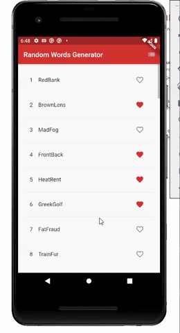

# Basic Random Words App w/ Flutter

## Built With

* [Flutter](https://flutter.dev/)
* [VS Code](https://code.visualstudio.com/)

## Usage

## License

Distributed under the MIT License. See `LICENSE` for more information.

## Contact

Aviciena Santoso - avi.santoso@gmail.com
Project Link: [https://github.com/AviSantoso/flutter-basic-random-words](https://github.com/AviSantoso/flutter-basic-random-words)

<!-- MARKDOWN LINKS & IMAGES -->
<!-- https://www.markdownguide.org/basic-syntax/#reference-style-links -->
[linkedin-shield]: https://img.shields.io/badge/-LinkedIn-black.svg?style=flat-square&logo=linkedin&colorB=555
[linkedin-url]: https://www.linkedin.com/in/aviciena-santoso/
